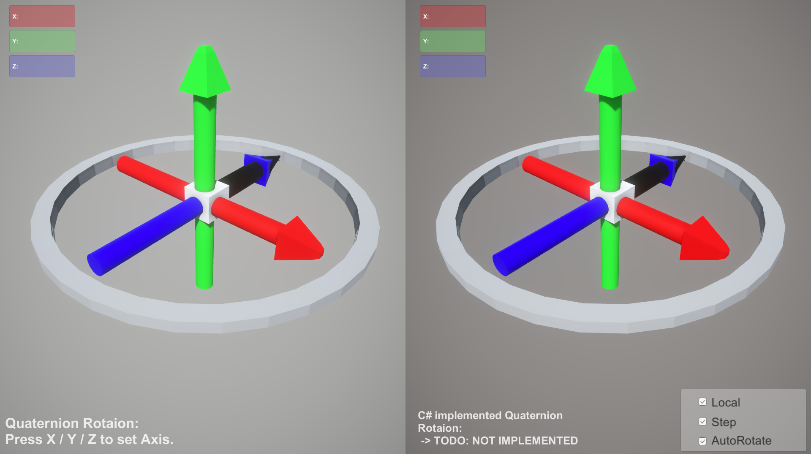

# Unity-WebGL-Quaternion-Sample
### Purpose of this repos.: 
Understanding the behavior of Unity's `Quaternion` class and partially implementing it in `C#`.

### Implementation
TODO

### Logs
- 2023/1/16: 
First I built a Unity scene to do the comparison as follows. 
And I want to implement my own "Quaternion"implementation in C# for the right side, but it is too challenging for me. So I will try this after learning more and more.

